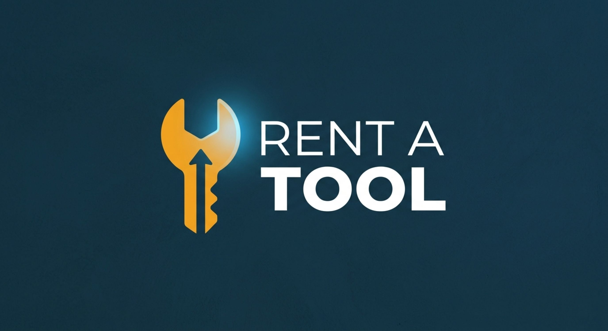

<p align="center">
  
</p>

<h1 align="center">Rent A Tool</h1>
<p align="center">A Windows desktop app for managing tool rentals — inventory, customers, rentals, returns, and payments.</p>

---

## Features

- 🔐 **Login** with role-based access (Admin / Cashier)
- 📊 **Dashboard** — rentals today, overdue returns, revenue, tool availability
- 🧰 **Tool Inventory** — add, edit, and track tool status
- 📝 **Rentals** — start a new rental (customer, tools, dates, deposit) and track active ones
- 👤 **Customers** — profiles, rental history, blacklist flag
- ⚙️ **Settings** — rates, late fee rules, users, backup

## Tech Stack

| Layer | Choice |
|---|---|
| UI | C++/CLI, Windows Forms |
| Database | MySQL |
| Platform | Windows, .NET Framework 4.8 |

## Getting Started

### Prerequisites
- Visual Studio 2022 with the **Desktop development with C++** workload and **C++/CLI support**
- .NET Framework 4.8
- MySQL Server 8.0+
- MySQL Connector/NET (or Connector/C++, depending on your data layer)

### Setup
1. Clone the repo:
   ```
   git clone https://github.com/NetworkChukka/rent-a-tool.git
   ```
2. Create the database:
   ```sql
   CREATE DATABASE rent_a_tool;
   ```
3. Import the schema (`Data/schema.sql`) and update the connection string in `Data/DbConfig.h` with your host, user, and password.
4. Open the solution in Visual Studio.
5. Set the project's Linker → System → SubSystem to **Windows**.
6. Build and run.

## Project Structure

```
Rent-A-Tool/
├── Header Files/
│   ├── dashboard.h
│   ├── loginform.h
│   ├── inventory.h
│   ├── rentals.h
│   ├── customers.h
│   └── settings.h
├── Source Files/
│   ├── dashboard.cpp
│   ├── loginform.cpp
│   ├── inventory.cpp
│   ├── rentals.cpp
│   ├── customers.cpp
│   └── settings.cpp
├── Resource Files/
│   ├── dashboard.resx
│   └── loginform.resx
└── Data/          # MySQL connection + queries (DbConfig.h, schema.sql)
```

## Screenshots

_Add screenshots of the Dashboard, Inventory, and New Rental pages here._

## Roadmap

- [ ] Late-fee calculation on return
- [ ] Payment history / receipts
- [ ] Reports export (Excel/PDF)

## License

MIT